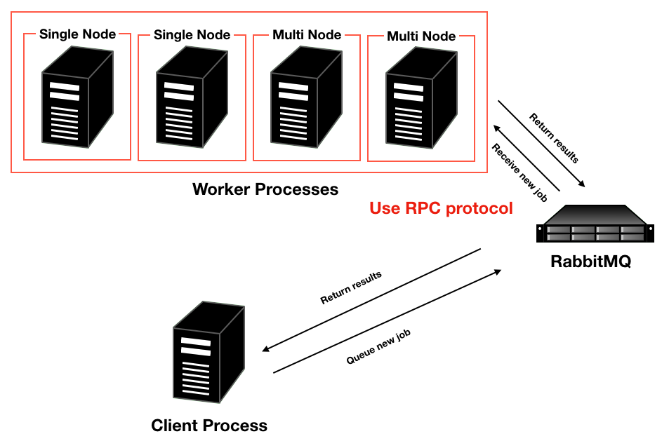

================
What is Polaris?
================

About
=========

Polaris is a hyperparameter optimization library for Python.
This library supports the experiments in both single and parallel execution.
And also you can easily run your experiments in parallel on multi nodes.
If you want to know more detail, please see :doc:`example page<example>`.

Algorithms
===========

For now, we supports three optimization algorithms.

* Random Search
* Bayesian Optimization
* TPE (Tree-structured Parzen Estimator)

And plan to support BOHB (Bayesian Optimiztion & Hyperband).

Architecture
============

Single Execution
-----------------

Just call the function you pass with the parameter calculated from past trials and return best params.
What you have to is just calling run() method from Polaris instance.

Parallel Execution
-------------------

Polaris use RabbitMQ to pass a context of experiment from a client to worker.
If you want to run experiments in parallel, you need to install RabbitMQ (see :doc:`here <install>`).

You need to run both client and worker processes.
We provide `polaris-worker` command to run a worker easily.
More detail, please see :doc:`example page<example>`.

  Parallel Execution Architecture

